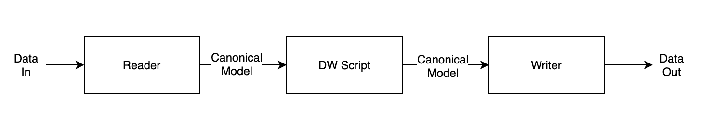

# 1.1 - DataWeave

DataWeave is a programming language designed for transforming data. It is MuleSoft’s primary language for data transformation, as well as the expression language used to configure components and connectors within [Mule](https://github.com/mulesoft/mule). However, DataWeave is also available in other contexts, like as a [command line tool](https://github.com/mulesoft-labs/data-weave-native). These tutorials will largely treat DataWeave as a standalone language.

DataWeave allows users to easily perform a common use case for integration developers: read and parse data from one format, transform it, and write it out as a different format. For example, a DataWeave script could take in a simple CSV file and transform it into an array of complex JSON objects. It could take in XML and write the data out to a flat file format. DataWeave allows the developer to focus on the transformation logic instead of worrying about the specifics of reading, parsing, and writing specific data formats in a performant way. Let’s take a look at how it does this.

When DataWeave receives data, it puts it through the reader. The reader’s job is to parse the input data into a canonical model. It then passes that model to the DataWeave script where it is used to generate the output, which is another canonical model. That last canonical model is passed into a writer. The writer is responsible for serializing the canonical model into the desired output data format.

Inputs and outputs are critical in DataWeave. Throughout this tutorial, we will indicate which input is being used with your script and as mentioned, we will show you the output as it is generated.
